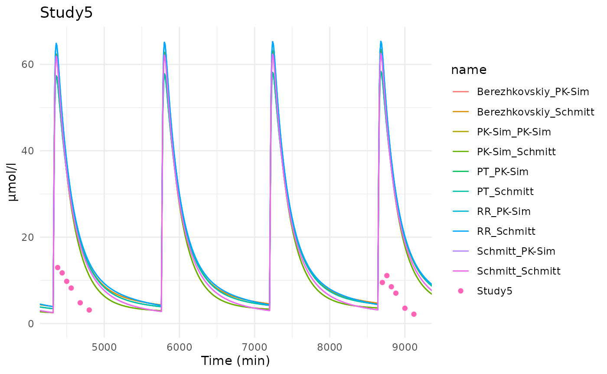
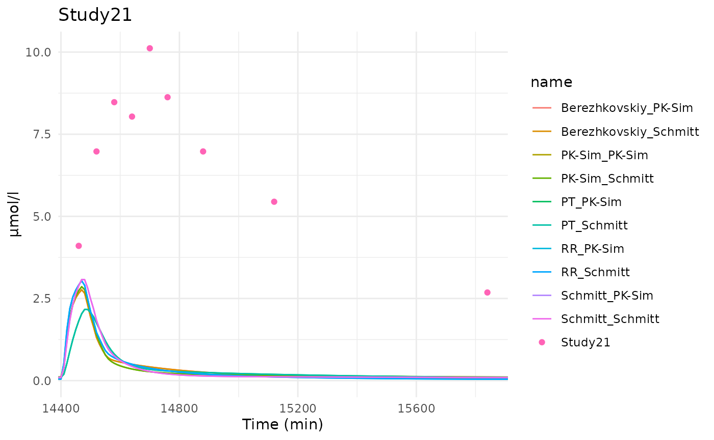
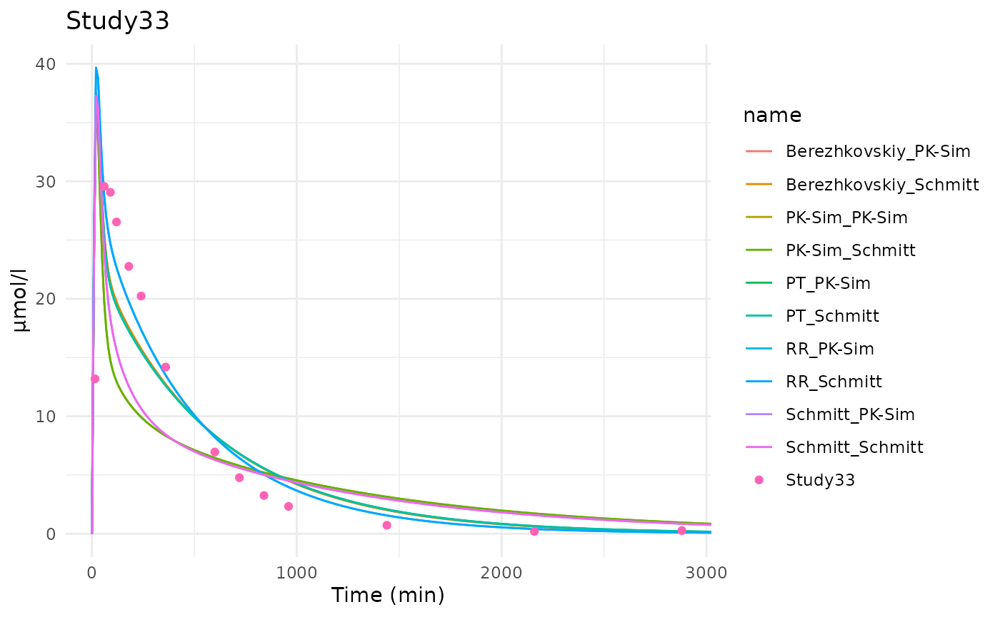
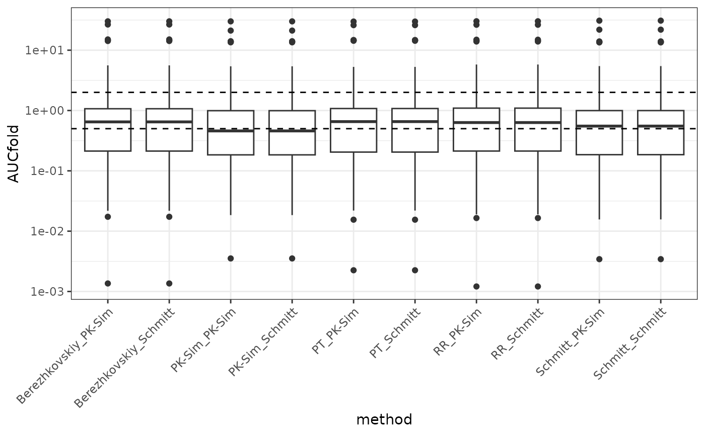
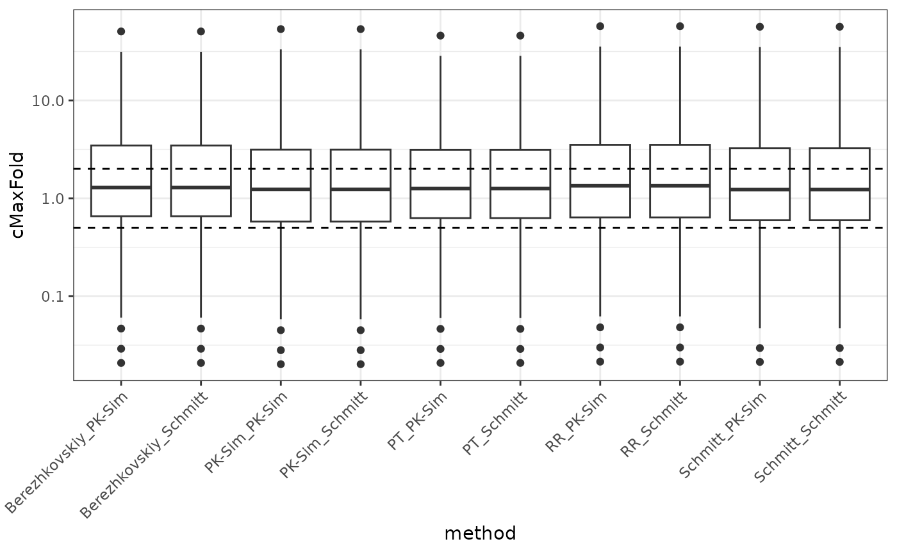
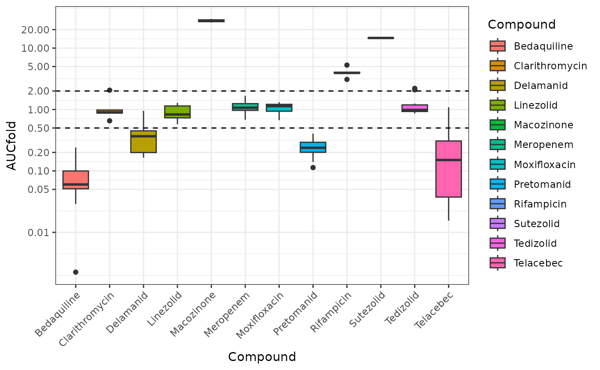
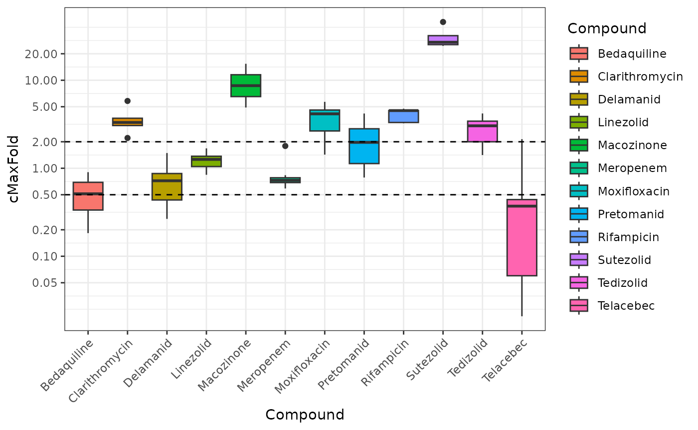
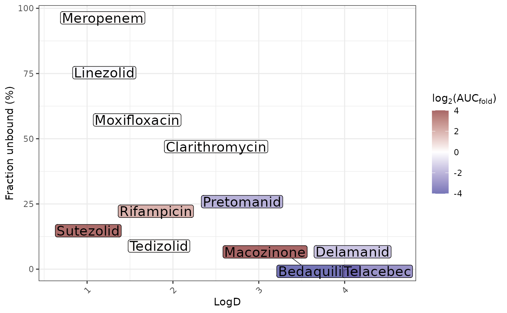
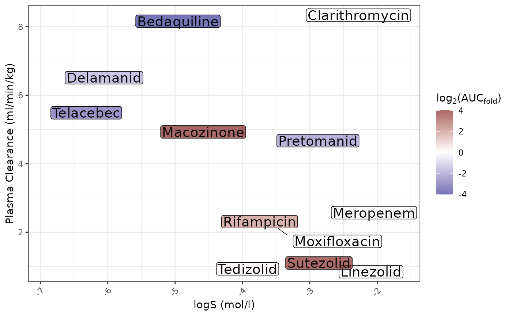

# Example for anti-Tuberculosis drugs

### Load needed libraries

For this example we will load a few libraries

``` r

# needed package for building the article
library(ESQhtpbpk) # package for HTPBPK
library(readxl) # package to read xlsx files that contains input data
library(dplyr) # package for easy manipulation of data
library(tidyr) # package for easy manipulation of data
library(stringr) # package for string manipulation
# packages for plotting
library(ggplot2)
library(plotly)
library(scales)
library(ggrepel)
```

### Load input files

A dataset of anti-TB drugs PK-profiles has been extracted from the
literature and is available in the package as an example dataset. The
dataset has been curated to focused on anti-TB drugs given without any
other co-administered drug to healthy individuals.

``` r

# Reading curated chembl dataset with AUC and Cmax values
path <- system.file(
  "extdata", 
  "TBStudyInputsForHTPBPK.xlsx", 
  package = "ESQhtpbpk"
)
```

The first sheet of the excel list the studies extracted.

``` r

# Reading curated chembl dataset with AUC and Cmax values
InputStudies <- read_excel(path, sheet = 1)
```

The second sheet of the excel list all the compound properties. Based on
[this
paper](https://link.springer.com/article/10.1007/s00204-024-03764-9) and
more specifically [Table
1](https://link.springer.com/article/10.1007/s00204-024-03764-9/tables/1),
we extracted compound properties from
[ADMETlab](https://admetlab3.scbdd.com/) QSAR as input to the HT-PBPK
model.

``` r

InputCompounds <- read_excel(path, sheet = 2) # QSARs obtained from ADMETlab 3.0
```

The third sheet of the excel list the protocols information to be
simulated. A protocol can spread multiple lines for the same study for
example in case of multiple administration with loading dose.

``` r

InputProtocol <- read_excel(path, sheet = 3)
```

In a few cases a dissolution profile was known and used as formulations,
in most cases it was assumed to be dissolved. Formulation parameters are
given in the fourth sheet of the excel file.

``` r

InputFormulations <- read_excel(path, sheet = 4) # QSARs obtained from ADMETlab 3.0
```

In the fifth sheet of the excel the observed PK-profiles with observed
concentration are listed.

``` r

InputObservedDataset <- read_excel(path, sheet = 5) # QSARs obtained from ADMETlab 3.0
```

### Preparing the studies for the pipeline

Based on the Chembl example we will also test the default setting and
with high tissue permeability

``` r

createStudies <- function(scenario, PC, CP){
  Studies <- list()

  # Create studies for each anti-TB compound
  # loop for each compounds to create them oonly once
  for (compoundIdx in seq_len(nrow(InputCompounds))) {
    # Create compound
    compoundName <- InputCompounds$Compound[compoundIdx]
    compound <- Compound$new(ID = compoundName)
  
    compound$setPropertyValue("Chlorine count", value = InputCompounds$Cl[compoundIdx])
    compound$setPropertyValue("Bromine count", InputCompounds$Br[compoundIdx])
    compound$setPropertyValue("Fluorine count", InputCompounds$`F`[compoundIdx])
    compound$setPropertyValue("Iodine count", InputCompounds$I[compoundIdx])
    compound$setPropertyValue("Molecular weight", InputCompounds$`MW (g/mol)`[compoundIdx], unit = "g/mol")
    compound$setPropertyValue(
      "Solubility", 
      10^InputCompounds$`logS - ADMETLab (mol/l)`[compoundIdx] * InputCompounds$`MW (g/mol)`[compoundIdx], 
      unit = "g/l"
    )
    compound$setPropertyValue("Lipophilicity", InputCompounds$`logD - ADMETLab (mol/l)`[compoundIdx])
    compound$setPropertyValue("Fraction unbound", InputCompounds$`Fu - ADMETLab`[compoundIdx], unit = "%")
    
    compound$addProperty(
      name = "PInt",
      parName = "Specific intestinal permeability (transcellular)",
      dimension = "Velocity",
      value = 10^InputCompounds$`logMDCK - ADMETLab (cm/s)`[compoundIdx],
      unit = "cm/s"
    )
    
    # test scenario with high tissue permeability as seen to improve in the chembl example
    if (scenario$Perm == "High") {
      compound$addProperty(
        name = "Perm",
        parName = "Permeability",
        dimension = "Velocity",
        value = 10,
        unit = "cm/s"
      )
    } 
          
    # add general clearance (as hepatic clearance)
    compound$addProcessProperty(
      processType = "Liver Plasma Clearance",
      propertyName = "Plasma clearance",
      parName = "Plasma clearance",
      dimension = "Flow per weight",
      value = InputCompounds$`cl-plasma - ADMETLab (ml/min/kg)`[compoundIdx], 
      unit = "ml/min/kg"
    )
    compound$addProcessProperty(
      processType = "Liver Plasma Clearance",
      propertyName = "Lipophilicity",
      parName = "Lipophilicity (experiment)",
      dimension = "Log Units",
      value = InputCompounds$`logD - ADMETLab (mol/l)`[compoundIdx]
    )
    compound$addProcessProperty(
      processType = "Liver Plasma Clearance",
      propertyName = "Fraction unbound",
      parName = "Fraction unbound (experiment)",
      dimension = "Fraction",
      value = InputCompounds$`Fu - ADMETLab`[compoundIdx],
      unit = "%"
    )
  
    # loop for all studies with that compound
    for (studyIdx in which(InputStudies$Compound == compoundName)) {
      studyId <- InputStudies$StudyID[studyIdx]
      studyProtocolId <- InputStudies$ProtocolID[studyIdx]
      protocolTable <- InputProtocol[InputProtocol$ProtocolID == studyProtocolId, ]
  
      # create study protocol
      prot <- AdvancedProtocol$new()
      for (i in seq_len(nrow(protocolTable))) {
        prot$addSchema(
          schemaName = paste0("Schema_", i),
          startTime = protocolTable$`StartTime (h)`[i],
          timeBetweenRepetitions = ifelse(is.na(protocolTable$`TimeBetweenRep (h)`[i]), 0, protocolTable$`TimeBetweenRep (h)`[i]),
          numberOfRepetitions = ifelse(is.na(protocolTable$NbRep[i]), 1, protocolTable$NbRep[i]),
          timeUnit = "h"
        )
  
        admin <- SimpleProtocol$new(
          route = protocolTable$Route[i],
          dose = protocolTable$Dose[i],
          doseUnit = protocolTable$DoseUnit[i],
          infusionTime = if (is.na(protocolTable$`InfusionTime (min)`[i])) {
            NULL
          } else {
            protocolTable$`InfusionTime (min)`[i]
          },
          infusionTimeUnit = "min",
          waterVolPerBW = if (is.na(protocolTable$`Water Volume/BW (ml/kg)`[i])) {
            NULL
          } else {
            protocolTable$`Water Volume/BW (ml/kg)`[i]
          },
          waterVolPerBWUnit = "ml/kg"
        )
  
        # For oral protocol add formulation if known
        if (protocolTable$Route[i] == "Oral") {
          if (protocolTable$FormulationID[i] == "Solution" || is.na(protocolTable$FormulationID[i])) {
            formulation <- createDissolvedFormulation(name = "Dissolved")
          } else {
            form <- InputFormulations[InputFormulations$FormulationID == protocolTable$FormulationID[i], ]
  
            if (form$`FormulationType` == "Weibull") {
              formulation <- createWeibullFormulation(
                name = "Weibull",
                lagTime = form$`lagTime (min)`,
                lagTimeUnit = "min",
                dissolutionTime50 = form$`disso50 (min)`,
                dissolutionTime50Unit = "min",
                shape = form$`shape`
              )
            }
          }
  
          admin$setFormulation(formulation = formulation)
        }
  
        prot$addProtocolToSchema(admin, schemaName = paste0("Schema_", i))
      }
      compound$setProtocol(prot)

      # PC/CP specified in function
      compound$PartitionCoefficientMethod <- PC
      compound$CellularPermeabilityMethod <- CP

      study <- Study$new(ID = paste0(studyId), compounds = list(compound), individual = "Human")
      Studies <- c(Studies, study)
    }
  }
  
  return(Studies)
} 
```

## Running the pipeline for the default scenario

``` r

scenario <- data.frame(Scenario = paste0("Scenario_", 1:2), Perm = c("Default", "High"))

PCs <- c("PK-Sim", "RR", "PT", "Schmitt", "Berezhkovskiy")
CPs <- c("PK-Sim", "Schmitt")
  
# initialise results list
results <- vector("list", length = 10)
names(results) <- expand.grid(PCs, CPs) %>% transmute(paste0(Var1, "_", Var2)) %>% pull()
  
outFolder <- file.path("TB_example", "Scenario_1")
dir.create(outFolder, recursive = TRUE)
      
# Test all PC and CP methods available in PK-Sim
for (PC in PCs) {
 for (CP in CPs) {
    Studies <- createStudies(scenario = scenario[1,], PC = PC, CP = CP)

    # Run the predictions
    results[[paste0(PC, "_", CP)]] <- runPredictions(
      studies = Studies, 
      outputFolder = file.path(outFolder, paste0(PC, "_", CP)),
      numberOfCores = 5,
      outputSelections = c("Organism|PeripheralVenousBlood|**|Plasma (Peripheral Venous Blood)"),
      simulationResolution = c(0, max(InputStudies$`EndTime (days)`) * 24 * 60, 0.1),
      saveResults = TRUE,
      saveSimulation = FALSE,
      queueSize = 200
    )
  }
}
```

### Calculate wanted metrics

First we will load the observed data using ospsuite compatible function.
We can create a function to load the observed data in an ospsuite way
and calculate the metric we want to compare to the observed data.

``` r

# create importer configuration and adjust column settings
importerConfiguration <- ospsuite::createImporterConfigurationForFile(
  filePath = path, 
  sheet = "ObservedData"
)
importerConfiguration$sheets <- "ObservedData"
importerConfiguration$timeColumn <- "Time"
importerConfiguration$isTimeUnitFromColumn <- TRUE
importerConfiguration$timeUnit <- "TimeUnit"
importerConfiguration$isMeasurementUnitFromColumn <- TRUE
importerConfiguration$measurementUnit <- "MeasurementUnit"
importerConfiguration$errorColumn <- NULL
importerConfiguration$addGroupingColumn("StudyID")
importerConfiguration$namingPattern <- "{StudyID}"

dataSets <- ospsuite::loadDataSetsFromExcel(
  xlsFilePath = path, importerConfigurationOrPath = importerConfiguration,
  importAllSheets = FALSE
)
```

We can create a function to calculate the metric we want to compare to
the observed data.

``` r

calculateMetrics <- function(results, obsData, studyID, outputPath, methodName) {
  # add molecular weight for unit conversion
  obsData[[studyID]]$molWeight <- InputCompounds$`MW (g/mol)`[InputCompounds$Compound == InputStudies$Compound[InputStudies$StudyID == studyID]]
  
  # Create a DataCombined holding simulation results and observed data
  # data for residuals calculation
  dataCombined <- ospsuite::DataCombined$new()
  dataCombined$addDataSets(obsData[[studyID]], groups = methodName)
  dataCombined$addSimulationResults(results[[studyID]], quantitiesOrPaths = outputPath, groups = methodName)
  
  # convert units to min and umol/l
  dataCombined <- ospsuite::convertUnits(
    dataCombined, 
    xUnit = ospsuite::ospUnits$Time$min, 
    yUnit = ospsuite::ospUnits$`Concentration [molar]`$`µmol/l`
  )
  
  dataCombined <- dataCombined %>% 
    pivot_wider(id_cols = xValues, names_from = dataType, values_from = yValues)
  
  # make linear interpolation to make sure simulation time points match observed time points
  if (any(is.na(dataCombined$simulated))) {
    dataCombined <- dataCombined %>%
      arrange(xValues) %>%
      mutate(
        simulated = approx(xValues, simulated, xValues)$y
      ) 
  }
  
  # only keep time matching observed data calculate lin and log residuals
  dataCombined <- dataCombined %>%
    filter(!is.na(observed)) %>% 
    mutate(
      residualsLog = abs(log(observed) - log(simulated)),
      residualsLin = abs(observed - simulated)
    )

  # Calculate Cmax from observed and simulated data
  cMaxObs <- max(dataCombined$observed)
  simData <- ospsuite::getOutputValues(
    simulationResults = results[[studyID]],
    quantitiesOrPaths = outputPath,
    addMetaData = TRUE)

  # ensure cMaxSim is in the same unit
  cMaxSim <- ospsuite::toUnit(
    quantityOrDimension = outputPath,
    values = max(simData$data[[outputPath]]), 
    sourceUnit = simData$metaData[[outputPath]]$unit, 
    targetUnit = ospsuite::ospUnits$`Concentration [molar]`$`µmol/l`, 
    molWeight = obsData[[studyID]]$molWeight, 
    molWeightUnit = "g/mol"
  )
  
  cMaxSim_obsTime <- max(dataCombined$simulated)

  # Calculate AUC_tLast using pracma on the same simulated time as observed time to have a fair comparison
  obsAUC <- pracma::trapz(dataCombined$xValues, dataCombined$observed)
  simAUC <- pracma::trapz(dataCombined$xValues, dataCombined$simulated)

  # Calculate fold point wise difference
  folds <- ospsuite.utils::foldSafe(
    x = pmax(dataCombined$observed, dataCombined$simulated), 
    y = pmin(dataCombined$observed, dataCombined$simulated)
  )

  # make summary of metrics
  output <- data.frame(
    foldC_first = folds[1],
    foldC_last = folds[length(folds)],
    obsCmax = cMaxObs,
    simCmax = cMaxSim,
    simCmax_obsTime = cMaxSim_obsTime,
    cMaxFold = cMaxSim / cMaxObs,
    cMaxFold_obsTime = cMaxSim_obsTime / cMaxObs,
    residualsLog = paste(dataCombined$residualsLog, collapse = ";"),
    residualsLogMean = mean(dataCombined$residualsLog),
    residualsLogMedian = median(dataCombined$residualsLog),
    residualsLin = paste(dataCombined$residualsLin, collapse = ";"),
    gmfe = exp(mean(abs(dataCombined$residualsLog))),
    rmse = sqrt(mean(dataCombined$residualsLin^2)),
    rMedianSE = sqrt(median(dataCombined$residualsLog^2)),
    folds = paste(folds, collapse = ";"),
    foldMean = mean(folds),
    foldMedian = median(folds),
    shareFold2 = sum(folds < 2) / length(folds) * 100,
    shareFold4 = sum(folds < 4) / length(folds) * 100,
    shareFold10 = sum(folds < 10) / length(folds) * 100,
    observedAUC = obsAUC,
    simulatedAUC = simAUC,
    AUCfold = simAUC / obsAUC
  )
  
  return(output)
}
```

Now let’s calculate the metric for all the partition coefficients and
cellular permeability tested.

``` r

metric_results <- lapply(
  names(results), 
  function(groupMethod) {
    res <- lapply(
      names(results[[groupMethod]]),
      function(studyID) {
        # calculate metrics for each groupMethod (i.e. PC/CP combination)
        res <- calculateMetrics(
          results = results[[groupMethod]], 
          studyID = studyID, 
          obsData = dataSets, 
          outputPath = "Organism|PeripheralVenousBlood|Compound1|Plasma (Peripheral Venous Blood)", 
          methodName = groupMethod
        )
        
        res$studyID <- studyID
        res$method <- groupMethod
        res$scenario <- "Scenario_1"
        return(res)
      }
    )
    
    res <-  t(res) %>% bind_rows()
    return(res)
  }
) %>% bind_rows()

# add compound name to metrics_results
metric_results$Compound <- InputStudies$Compound[match(metric_results$studyID, InputStudies$StudyID)]
write.csv(metric_results, file = file.path(outFolder, "metrics_results.csv"), row.names = FALSE)
```

The results have already been evaluated and the file is available in the
package and can be loaded as follows:

``` r

metric_results <- read.csv(system.file("extdata", "TB_example", "Scenario_1", "metrics_results.csv", package = "ESQhtpbpk"))
```

### Looking at the results

We can also plot the time profiles of the simulated and observed data
for each study and save it to a pdf if we want to.

Let’s make a function to create the plots for a specific study:

``` r

plotPK <- function(results, obsData, studyID, outputPath) {
  # create dataCombined
  dataCombined <- ospsuite::DataCombined$new()
  # add molecular weight to observed data for unit conversion
  MW <- InputCompounds$`MW (g/mol)`[InputCompounds$Compound == InputStudies$Compound[InputStudies$StudyID == studyID]]
  obsData[[studyID]]$molWeight <- MW
  dataCombined$addDataSets(obsData[[studyID]])
  
  # get simulated results for all PC/CP methods
  for (groupMethod in names(results)) {
    # ensure sim did not fail
    if (!is.null(results[[groupMethod]][[studyID]])) {
      dataCombined$addSimulationResults(
        results[[groupMethod]][[studyID]], 
        quantitiesOrPaths = outputPath, 
        names = groupMethod
      )
    }
  }
  
  # convert units to min and umol/l
  data <- ospsuite::convertUnits(
    dataCombined, 
    xUnit = ospsuite::ospUnits$Time$min, 
    yUnit = ospsuite::ospUnits$`Concentration [molar]`$`µmol/l`
  )

  studyXLim <- data %>% filter(dataType == "observed") %>% select(xValues) %>% range()

  p <- ggplot(data, aes(x = xValues, y = yValues, color = name)) + 
    geom_line(data = data %>% filter(dataType == "simulated")) + 
    geom_point(data = data %>% filter(dataType == "observed")) + 
    theme_minimal() + 
    coord_cartesian(xlim = studyXLim) + 
    labs(title = studyID, y = unique(data$yUnit), x = paste0(unique(data$xDimension), " (", unique(data$xUnit), ")"))
  
  return(p)
}
```

Let’s look at a few plots. We can see that few predictions works well
while other don’t.

``` r

p <- plotPK(
  results = results, 
  obsData = dataSets, 
  studyID = "Study5", 
  outputPath = "Organism|PeripheralVenousBlood|Compound1|Plasma (Peripheral Venous Blood)"
)

p
```



``` r

p <- plotPK(
  results = results, 
  obsData = dataSets, 
  studyID = "Study21", 
  outputPath = "Organism|PeripheralVenousBlood|Compound1|Plasma (Peripheral Venous Blood)"
)

print(p)
```



``` r

p <- plotPK(
  results = results, 
  obsData = dataSets, 
  studyID = "Study33", 
  outputPath = "Organism|PeripheralVenousBlood|Compound1|Plasma (Peripheral Venous Blood)"
)

print(p)
```



We can easily make a pdf with all studies.

``` r

pdf(file.path(outFolder, "Plots.pdf"), width = 6, height = 5)
for (studyID in InputStudies$StudyID) {
  p <- plotPK(
    results = results, 
    obsData = dataSets, 
    studyID = studyID, 
    outputPath = "Organism|PeripheralVenousBlood|Compound1|Plasma (Peripheral Venous Blood)"
  )
  print(p)
}
dev.off()
```

Let’s look at the overall metrics results across studies and compare the
different PC/CP methods. For the anti-TB drug overall the AUC ratio tend
to be slightly underpredicted while the Cmax ratio is slightly
overpredicted. However the PC/CP methods only have a minor impact on the
results probably because the pKa values have not been taken into
account.

``` r

p <- ggplot(metric_results) + 
  geom_boxplot(aes(y = AUCfold, x = method)) + 
  scale_y_log10() + 
  geom_hline(yintercept = 0.5, linetype = "dashed") + 
  geom_hline(yintercept = 2, linetype = "dashed") + 
  theme_bw() + 
  theme(axis.text.x = element_text(angle = 45, hjust = 1))
p
```



``` r

p <- ggplot(metric_results) + 
  geom_boxplot(aes(y = cMaxFold, x = method)) + 
  scale_y_log10() + 
  geom_hline(yintercept = 0.5, linetype = "dashed") + 
  geom_hline(yintercept = 2, linetype = "dashed") + 
  theme_bw() + 
  theme(axis.text.x = element_text(angle = 45, hjust = 1))
p
```



Let’s look at how many studies have an AUC or Cmax within 2 fold of the
observed values. With all methods we have around 40% of the studies with
an AUC within 2 fold and around 50-60% of the studies with a AUC within
4 fold. Similarly we have 40% of the studies with an Cmax within 2 fold
and around 75% of the studies with a Cmax within 4 fold.

``` r

tmp <- metric_results %>% 
  mutate(
    AUC2fold = AUCfold <= 2 & AUCfold >= 0.5, 
    Cmax2fold = cMaxFold <= 2 & cMaxFold >= 0.5,
    AUC4fold = AUCfold <= 4 & AUCfold >= 1/4, 
    Cmax4fold = cMaxFold <= 4 & cMaxFold >= 1/4,
  ) %>% 
  select(method, AUC2fold, Cmax2fold, AUC4fold, Cmax4fold) %>% 
  group_by(method) %>% 
  summarize_all(.funs = ~ sum(.x) / n() * 100)
```

However some compound might have more studies than other, for a fairer
comparison we will look after first average per compound. When first
averaging per compound we see similar results, mean AUC is within 2 fold
for ~42% of the compounds, and within 4-folds for half of them, while
cMax is within 2-fold for 1/3 to 42% of the compounds and within 4 fold
for around 2/3 to 75 % of the compounds.

``` r

tmp <- metric_results %>% 
  group_by(Compound, method) %>% 
  select(AUCfold, cMaxFold) %>%
  summarise_all(mean, ) %>% 
  group_by(method) %>%
  select(-Compound) %>% 
  mutate(
    AUC2fold = AUCfold <= 2 & AUCfold >= 0.5, 
    Cmax2fold = cMaxFold <= 2 & cMaxFold >= 0.5,
    AUC4fold = AUCfold <= 4 & AUCfold >= 1/4, 
    Cmax4fold = cMaxFold <= 4 & cMaxFold >= 1/4,
  ) %>% 
  summarize_all(.funs = ~ sum(.x) / n() * 100)
#> Adding missing grouping variables: `Compound`, `method`
```

If we look at the result for Poulin and Thiel partition coefficient
method and PK-Sim cellular permeability method in more details, we see
some correlation between AUC ratio and Cmax ratio.

``` r

p <- ggplot(metric_results %>% filter(method == "PT_PK-Sim")) + 
  geom_point(aes(y = AUCfold, x = cMaxFold, color = Compound), alpha = 0.5, size = 3) + 
  scale_y_log10(breaks = c(0.01, 0.05, 0.10, 0.2, 0.5, 1, 2, 5, 10, 20)) + 
  scale_x_log10(breaks = c(0.01, 0.05, 0.10, 0.2, 0.5, 1, 2, 5, 10, 20)) + 
  geom_hline(yintercept = 0.5, linetype = "dashed") + 
  geom_hline(yintercept = 2, linetype = "dashed") + 
  geom_vline(xintercept = 0.5, linetype = "dashed") + 
  geom_vline(xintercept = 2, linetype = "dashed") + 
  theme_bw()

ggplotly(p)
```

We can also notice that most studies with the same compounds cluster
together, indicating that the over/under prediction is compound not due
to a particular study design (except one for bedaquiline that has a very
long follow up compared to the other study over emphasizing the
underprediction of the AUC).

``` r

p <- ggplot(metric_results %>% filter(method == "PT_PK-Sim")) + 
  geom_boxplot(aes(y = AUCfold, x = Compound, fill = Compound)) + 
  scale_y_log10(breaks = c(0.01, 0.05, 0.10, 0.2, 0.5, 1, 2, 5, 10, 20)) + 
  geom_hline(yintercept = 2, linetype = "dashed") + 
  geom_hline(yintercept = 0.5, linetype = "dashed") + 
  theme_bw() + 
  theme(axis.text.x = element_text(angle = 45, hjust = 1))
p
```



``` r

p <- ggplot(metric_results %>% filter(method == "PT_PK-Sim")) + 
  geom_boxplot(aes(y = cMaxFold, x = Compound, fill = Compound)) + 
  scale_y_log10(breaks = c(0.01, 0.05, 0.10, 0.2, 0.5, 1, 2, 5, 10, 20)) + 
  geom_hline(yintercept = 2, linetype = "dashed") + 
  geom_hline(yintercept = 0.5, linetype = "dashed") + 
  theme_bw() + 
  theme(axis.text.x = element_text(angle = 45, hjust = 1))
p
```



If we look at the inputs to understand what drives the over/under
prediction we can see that compounds with high lipophilicity or low
fraction unbound, as well as low solubility are less well predicted.

``` r

# add compound properties to metric results
metric_results$Lipo <- InputCompounds$`logD - ADMETLab (mol/l)`[match(metric_results$Compound, InputCompounds$Compound)]
metric_results$Solubility <- InputCompounds$`logS - ADMETLab (mol/l)`[match(metric_results$Compound, InputCompounds$Compound)]
metric_results$PInt <- InputCompounds$`logMDCK - ADMETLab (cm/s)`[match(metric_results$Compound, InputCompounds$Compound)]
metric_results$MW <- InputCompounds$`MW (g/mol)`[match(metric_results$Compound, InputCompounds$Compound)]
metric_results$Fu <- InputCompounds$`Fu - ADMETLab`[match(metric_results$Compound, InputCompounds$Compound)]
metric_results$Cl <- InputCompounds$`cl-plasma - ADMETLab (ml/min/kg)`[match(metric_results$Compound, InputCompounds$Compound)]
```

``` r

p <- metric_results %>% 
  filter(method == "PT_PK-Sim") %>% 
  summarise(log2AUCfold_avg = mean(log2(AUCfold)), .by = c(Compound, Lipo, Cl, Fu, Solubility, PInt, MW)) %>% 
  ggplot + 
  scale_fill_gradient2(
    low = alpha(muted("blue"), 0.7),
    mid = alpha("white",0.7),
    high = alpha(muted("red"), 0.7),
    midpoint = 0, 
    limits = c(-4, 4), 
    oob = scales::squish
  ) + 
  geom_label_repel(
    mapping = aes(y = Fu, x = Lipo, label = Compound, fill = log2AUCfold_avg), 
    label.size = NA, 
    size = 5, 
    segment.size = 0.25, 
    label.padding = 0.1
  ) + 
  theme_bw() + 
  theme(axis.text.x = element_text(angle = 45, hjust = 1)) + 
  labs(y = "Fraction unbound (%)", x = "LogD", fill = bquote(log[2]*"("*AUC[fold]*")"))

p
```



``` r

p <- metric_results %>% 
  filter(method == "PT_PK-Sim") %>% 
  summarise(log2AUCfold_avg = mean(log2(AUCfold)), .by = c(Compound, Lipo, Cl, Fu, Solubility, PInt, MW)) %>% 
  ggplot() + 
  scale_fill_gradient2(
    low = alpha(muted("blue"), 0.7),
    mid = alpha("white",0.7),
    high = alpha(muted("red"), 0.7),
    midpoint = 0, 
    limits = c(-4,4), 
    oob = scales::squish
  ) + 
  geom_label_repel(
    mapping = aes(y = Cl, x = Solubility, label = Compound, fill = log2AUCfold_avg), 
    label.size = NA, 
    size = 5, 
    segment.size = 0.25, 
    label.padding = 0.1
  ) + 
  theme_bw() + 
  theme(axis.text.x = element_text(angle = 45, hjust = 1)) + 
  labs(x = "logS (mol/l)", y = "Plasma Clearance (ml/min/kg)", fill = bquote(log[2]*"("*AUC[fold]*")"))
p
```


